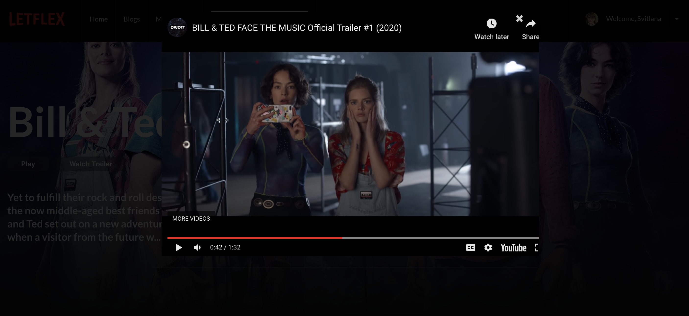
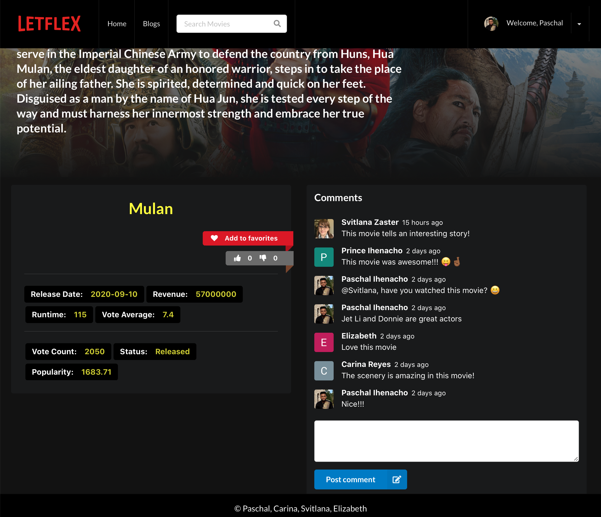
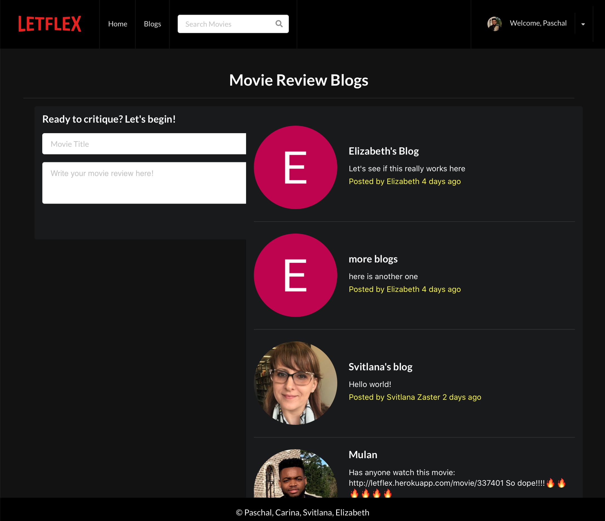

# Letflex

## Live Site:

[Letflex](https://letflex.herokuapp.com/)

## Description

Our Netflix clone app will allow users to login directly via their google account. The user will then have the option to search films and shows using the name or keywords. The app will then display relevant results. User will be able to watch movie trailers. The user will also be able to manage their profile and watch-list, they can update their name/picture or remove/add content from their watch-list. This application has a review feature where the user can comment on a specific movie.

## GIF/Image

## Table of Contents

- [Letflex](#letflex)
  - [Live Site:](#live-site)
  - [Description](#description)
  - [GIF/Image](#gifimage)
  - [Table of Contents](#table-of-contents)
  - [Installation](#installation)
  - [Tech Stack](#tech-stack)
  - [Usage](#usage)
  - [Collaborators](#collaborators)
  - [Future-Development](#future-development)
  - [Credits](#credits)
  - [License](#license)
  - [Tests](#tests)
  - [Questions](#questions)

## Installation

Clone the code on your machine, install and import all dependencies with `npm install`.

Run the application with a command `npm start` in a terminal.

## Tech Stack

- [React](https://reactjs.org) A JavaScript library for building user interfaces.

- [Semantic UI](https://semantic-ui.com) Semantic is a development framework that helps create beautiful, responsive layouts using human-friendly HTML.

## Usage

Use the app deployed to Heroku, and/or clone the code on your machine and run npm install to import all dependencies.

Run the application with a command npm start in a terminal.

## Collaborators

- [Carina](https://github.com/Creyes17e)
- [Paschal](https://github.com/paschalihenacho)
- [Svitlana](https://github.com/szaster)
- [Elizabeth](https://github.com/lisasosa)

## Future-Development

Add a filter option, where you can search content based on genre. Our app will also have a rate and review feature, reactions will also be incorporated.

## Credits
- [Clever Programmer](https://www.cleverprogrammer.com)
- [John Ahn](https://www.youtube.com/channel/UCFyXA9x8lpL3EYWeYhj4C4Q/playlists)
- [WJ Prajumsook](https://www.youtube.com/channel/UCpjmxyGKA1iBRU_k0sSftJA/playlists)
## License

License: MIT

## Tests

No tests

## Questions

If you have any questions you can reach us by clicking below.

- [Carina](https://github.com/Creyes17e)
- [Paschal](https://github.com/paschalihenacho)
- [Svitlana](https://github.com/szaster)
- [Elizabeth](https://github.com/lisasosa)

You also can file an [issue](https://github.com/paschalihenacho/Letflex/issues) if you find a bug.
